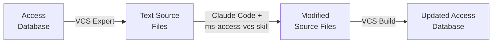

# Microsoft Access Skill for Claude Code

An AI agent skill that enables [Claude Code](https://docs.anthropic.com/en/docs/claude-code) to create, modify, and manage Microsoft Access databases through text-based source files.

## What It Does

This skill teaches Claude Code how to work with Microsoft Access databases exported via the [Access Version Control System (VCS)](https://github.com/joyfullservice/msaccess-vcs-addin) add-in. With it, Claude Code can create and edit:

- Tables, relationships, and queries
- Forms (including master-child subforms)
- Reports with grouping, totals, and formatting
- VBA modules and event-driven code
- Database properties and startup configuration

## How It Works



1. **Export** — Use the VCS add-in to export your Access database to text-based source files (`.bas`, `.cls`, `.sql`, `.xml`, `.json`)
2. **Edit** — Claude Code reads and modifies these source files using the ms-access-vcs skill, which understands the binary text format, control properties, VBA wiring, and all the structural rules required for a clean import
3. **Build** — Use the VCS add-in to rebuild the Access database from the modified source files

This also works for **new databases** — Claude Code can generate an entire database from a single prompt.

## Prerequisites

- **Microsoft Windows** with Microsoft Access installed
- **[Access Version Control System (VCS)](https://github.com/joyfullservice/msaccess-vcs-addin)** — the add-in that exports/imports Access databases as text
- **[Claude Code](https://docs.anthropic.com/en/docs/claude-code)** — Anthropic's CLI-based AI coding agent

> [!NOTE]
> [OpenCode](https://opencode.ai/) is also supported as an alternative AI agent. The skill format is compatible with both tools.

## Getting Started

### 1. Install the Skill

Copy the `.claude/skills/ms-access-vcs` folder into your project:

```
your-project/
├── .claude/
│   └── skills/
│       └── ms-access-vcs/
│           ├── SKILL.md
│           └── LICENSE
├── YourDatabase.accdb.src/
│   ├── forms/
│   ├── queries/
│   ├── tables/
│   └── ...
```

Alternatively, install it globally at `~/.claude/skills/ms-access-vcs/` to make it available across all your projects.

### 2. Export Your Database (Existing Projects)

If you have an existing Access database:

1. Open the database in Microsoft Access
2. Use the VCS add-in: **Version Control → Export All Source**
3. This creates a `.accdb.src/` folder containing all database objects as text files

### 3. Use Claude Code

Start Claude Code in your project directory and describe what you want:

```
claude
```

For new databases, you can describe the entire application in a single prompt. For existing databases, describe the changes you need.

### 4. Build the Database

After Claude Code finishes editing the source files:

1. Open Microsoft Access
2. Use the VCS add-in: **Version Control → Build From Source**
3. Navigate to your `.accdb.src/` folder
4. The add-in rebuilds the complete database

## Example

The included `CustomerOrders.accdb.src/` directory is a complete working example generated from this prompt:

<details>
<summary>View the full prompt</summary>

```
Let's use the ms-access-vcs skill to create a new microsoft access database to collect
customer details, with fields like name, address, phone number etc. and also create orders,
with parent fields like order number, order date, and child fields like item description,
unit price net, quantity, sub total net.

For the database we're going to need a startup screen with 3 buttons, customers, orders and
exit, that opens automatically on startup.

For customers we're going to need a list view by default with open, add and close buttons on
the bottom. Open and add will take us to a data entry/edit screen with buttons Save and Close
or Discard and Close.

For orders we're going to need a similar setup, list view by default showing parent fields,
with add, open and close buttons on the bottom. Open and add will take us to a data entry/edit
screen with buttons Save and Close or Discard and Close. The add/edit screen should show parent
order fields at the top and have a linked master-child subform for the order items below.

Let's also add a Preview Order button to the add/edit order screen that opens an order report
showing the customer details, order details and order items for the active order. We'll also
need to add a total net to the bottom summing the order item sub total net records. Then include
a line below for 10% GST, and a grand total inc. gst.
```

</details>

This single prompt generated 3 tables, 4 queries, 6 forms, 1 report, a VBA navigation module, and all supporting configuration — a fully functional order management application.

## Dev Container (Recommended)

A `.devcontainer/` configuration is included for running Claude Code in an isolated Docker container. This is recommended for security — AI agents should not have unrestricted access to your host system.

**Requirements:**
- [Docker Desktop](https://www.docker.com/products/docker-desktop/) (or another Docker runtime)
- [Dev Containers](https://marketplace.visualstudio.com/items?itemName=ms-vscode-remote.remote-containers) extension for VS Code

Open the project in VS Code and select **Reopen in Container** when prompted.

## Tips

- **Complex prompts trigger planning mode.** Claude Code will automatically enter plan mode for large requests. When planning is complete, choose **"Yes, clear context and auto-accept edits"** for the smoothest experience.
- **Existing projects work best.** The skill is even more effective with existing databases since Claude Code has real examples of your code style, naming conventions, and patterns to follow.
- **Use `/init` for ongoing work.** If you plan to use Claude Code repeatedly on a project, run `/init` to generate a `CLAUDE.md` file that provides persistent project context.
- **SQL Server backends are supported.** For linked tables backed by SQL Server, include the database schema in your project (e.g., via the [SQL Database Projects](https://marketplace.visualstudio.com/items?itemName=ms-mssql.sql-database-projects-vscode) VS Code extension).

## Project Structure

```
.claude/skills/ms-access-vcs/   # The skill (SKILL.md)
.devcontainer/                   # Dev container configuration
CustomerOrders.accdb.src/        # Example database source files
├── dbs-properties.json          #   Database properties & startup config
├── vcs-options.json             #   VCS add-in settings
├── forms/                       #   Form layout (.bas) and code (.cls)
├── reports/                     #   Report definitions
├── queries/                     #   Query metadata (.bas) and SQL (.sql)
├── modules/                     #   VBA standard modules
├── tbldefs/                     #   Table definitions (XML schema)
└── relations/                   #   Relationship definitions (JSON)
```

## Contributing

Contributions are welcome! If you find issues or have improvements to suggest — especially to the skill definition — please open an issue or submit a pull request.

## License

This project uses a dual-license model:

| Component | License | Summary |
|-----------|---------|---------|
| **ms-access-vcs skill** (`.claude/skills/ms-access-vcs/`) | [CC BY-SA 4.0](https://creativecommons.org/licenses/by-sa/4.0/) | Free to use in any project. Modifications to the skill itself must be attributed and shared under the same terms. |
| **Everything else** | [MIT](LICENSE) | Permissive. Use however you like. |

**What this means for you:**
- You can freely use this skill in any project — personal, commercial, open-source, or closed-source
- Your Access database projects are **not** affected by the skill's license
- If you modify and redistribute the *skill itself*, you must give credit and share your changes under CC BY-SA 4.0

## Acknowledgments

- **[MSAccess-VCS](https://github.com/joyfullservice/msaccess-vcs-addin)** by joyfullservice — the Version Control System add-in that makes this entire workflow possible
- **[Claude Code](https://docs.anthropic.com/en/docs/claude-code)** by Anthropic — the AI coding agent that powers the editing experience
